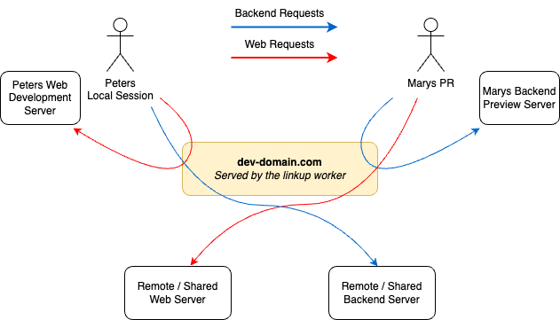

<h1 align="center" style="font-size: 3em;">🔗 Linkup</h1>

<p align="center">
  <a href="docs/README.md">
    
  </a>
</p>

> Run the services you change, get the rest for free.

Linkup lets you combine local and remote services to create cheap yet complete
development environments by leveraging Cloudflare Workers and Tunnels under the
hood.

A web application is usually made of many services, and a change typically
touches one or two of them. With Linkup, the services you didn't change are
shared, and each request is routed to either your machine, a PR preview deploy
or the shared environment.



## Getting started

You'll need a Cloudflare account with a domain that Linkup can use.

Build and install the CLI from source (requires a
[Rust toolchain](https://rustup.rs/)):

```sh
cargo install --git https://github.com/endformdev/linkup linkup-cli
```

Deploy the Linkup worker and the rest of the infrastructure to your Cloudflare
account (see [Deploy Linkup to Cloudflare](docs/guides/deploy-linkup.md) for
details). When it finishes, it prints the `worker_url` and `worker_token` to
use in your config.

```sh
linkup infra \
  --email you@example.com \
  --api-key <api-key> \
  --account-id <account-id> \
  --zone-ids <zone-id> \
  deploy
```

Describe your services in a config file:

```yaml
linkup:
  worker_url: https://where.linkup.is.deployed.com
  worker_token: worker_token_from_linkup_deploy
services:
  - name: web
    remote: https://web-dev.hosting-provider.com
    local: http://localhost:3000
  - name: backend
    remote: https://api-dev.hosting-provider.com
    local: http://localhost:9000
domains:
  - domain: dev-domain.com
    default_service: web
    routes:
      - path: /api/v1/.*
        service: backend
```

Point Linkup at it with the `LINKUP_CONFIG` environment variable (or pass
`--config` to each command):

```sh
export LINKUP_CONFIG=/path/to/linkup.yaml
```

Then start a session and route the service you're working on to your machine:

```sh
linkup start              # Start a session and get your session URLs
linkup route local web    # Send `web` traffic to your local dev server
linkup status             # See where each service is routed and whether it's healthy
linkup stop               # Stop the session and revert env files
```

## Documentation

The full documentation lives in [`docs/`](docs/README.md).

## Acknowledgements

This repository started as a fork of
[mentimeter/linkup](https://github.com/mentimeter/linkup), originally built by
[Mentimeter](https://github.com/mentimeter), and is now developed independently.
